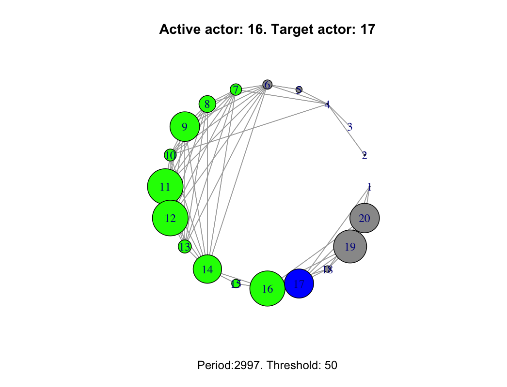
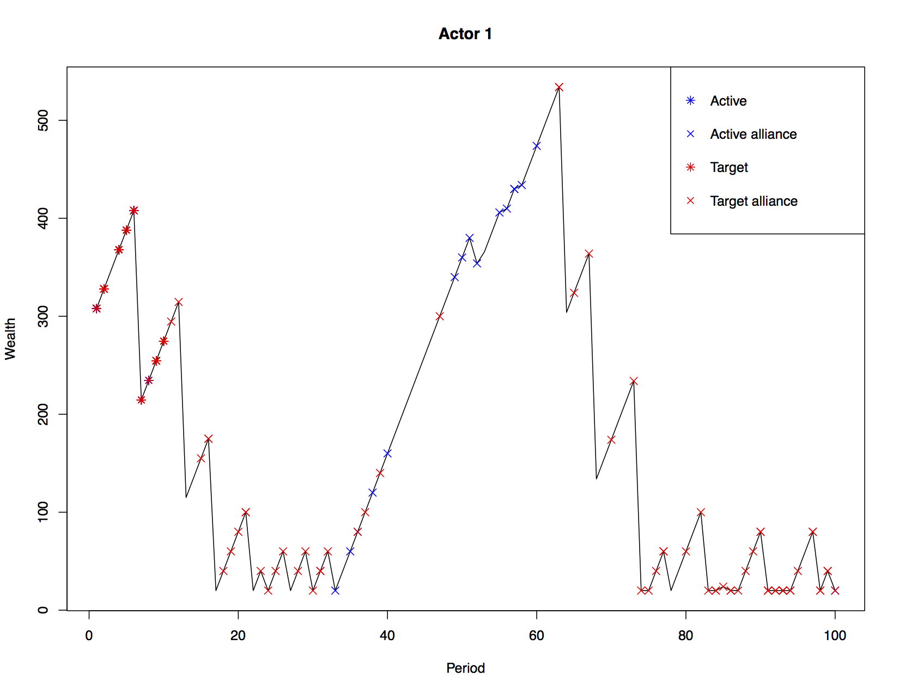
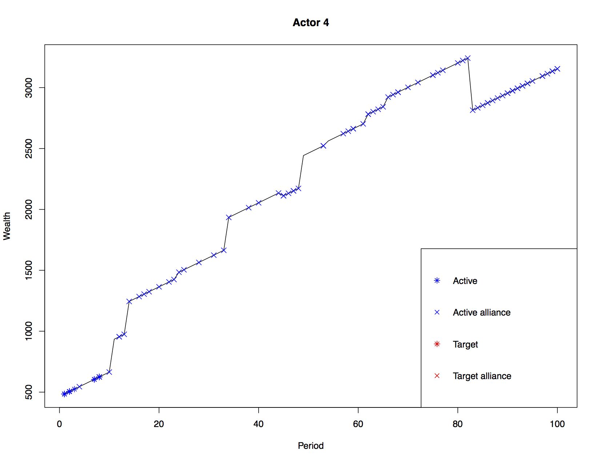

<a href="#introduction"> 1.1 Introduction </a>

<a href="#dynamics"> 1.2. Dynamics </a>

<a href="#parameters"> 1.3. Parameters </a>

<a href="application">  1.4 Further applications </a>

<h2 id="introduction"> 1.1. Introduction </h2>
In this project, we create a shiny app to simulate the tribute game proposed by Robert Axelrod [1].

One of the goals in the Tribute game is to answer the question:
<h4>How can new political actors emerge from an aggregation of smaller political actors? </h4>
Actors compete for resources using heuristic rules, and the result is the formation of new global actors.

<h2 id="dynamics"> 1.2. Dynamics of the game  </h2>
Initial conditions:
<ul>
<li>N actors are organised in a ring. </li>
<li>An  actor i has an initial wealth of Wi with Wi a random number between 300 and 500. </li>
</ul>
<ol>
<li> Each Period, three actors A1, A2, A3 are chosen at random. </li>
<li> Actor Ai chooses a neighbour actor Bi and demands a tribute of 250. </li>
<li> Actor Bi chooses to pay or go to war, depending on which will cause less loss of wealth. </li>
</ol>

 If  actor Bi pays the tribute, then the commitments between actor Ai and Bi increase by 10% (the maximum value is 100%).

 If they fight, then their commitment decrease by 10% (minimum value 0%). 

 An actor C  supports actor Ai if the commitment between them is larger than the commitment between C and Bi, 
and there is a sequence of actors supporting Ai from C to Ai. 

 In the same way, the target actor may receive the support from other actors. 

 For instance, actor 16 demands a tribute from actor 17; and actor 7 supports actor 16 
because actors 9-15 support actor 16 and its commitment to actor 17 is stronger than to actor 16. 

 If actor Bi decides to go to war, then actors supporting Ai lose 25% of the  total wealth of the actors supporting Bi times the commitment to actor Ai. 

 In the same manner, actors supporting actor 
 lose wealth if actor Bi decides to go to war.

 If there is a war, the commitment between actors fighting on the same side is increased by $10%, 
and between actors in opposite side is decreased by  10%.

<h2>Questions:</h2>
<ol>
<li> How does the cost of war affect the formation of alliances? </li>
<li> Do alliances last for long period of time? </li>
<li> How is the distribution of wealth after 100 periods, 1000 periods?   </li>
<li> How does war affect the wealth of the richest actor? </li>

</ol>

<h2 id="#parameters"> 1.3. Parameters </h2>
In our application, you can change the following parameters:
<ul>
<li> The number of actors. </li>
<li>  The cost of war (between 0 and 1). </li>
<li> The Number of Periods.   </li>
<ul>

You can plot:
<ul>
<li> The trend of wealth between two actors.  </li>
<li> The commitment network:
<ol>
<li> A link exists between to agents if their commitment is larger than the threshold (threshold between [0,1]). </li>
<li> The size of the nodes can be proportional to their wealth. </li>
</ol>
</li>
<li>
A histogram showing the wealth of the actors supporting Ai and 
.
</li>
<ul>

<h2 id="#application"> 1.4 Further applications</h2>

 We add the feature to download the simulated data to perform your data analysis. 

For instance, you can check how war affects the wealth of the actors.

<h3> Why does the wealth of actor 4 decreases in period 83?</h3>
<ol>
<li> The richest actor 4 targets one of the poorest actors, actor 1. </li>
<li> For actor 1 it is more expensive to go to war, it has nothing to lose than paying the tribute. </li>
<li> However, the rich actor 10 is committed to defend actor 1. </li>
<li> The war between actors 2-6 against actors 1 and 10 is an expensive war. </li>
<li> After the war, actor 9 becomes the richest actor. </li>
</ol>

<h3> Who targets the richest actor?  </h3>

<ol>
<li>The richest  actor 4 is never a target.  </li>
<li> The poorest actor 1 is constantly being a target. </li>
</ol>

